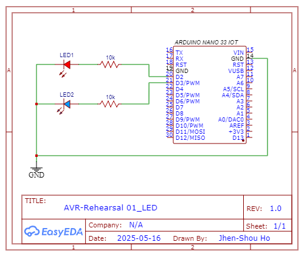
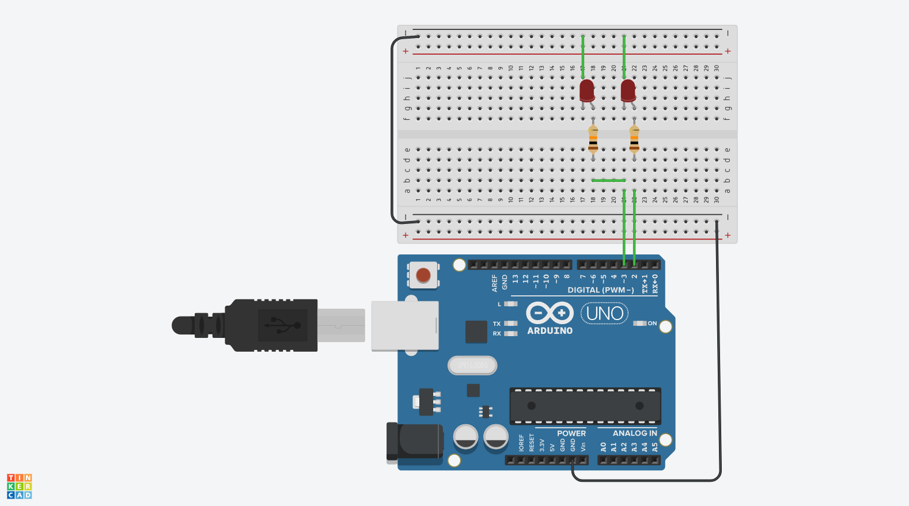

### Overview
This is a simple AVR microcontroller program written in C that controls LEDs using PORTD.  
It demonstrates three key concepts:  
1. PORT I/O - Controlling output pins.
2. DDR (Data Direcion Register) - Setting pins as input or output.
3. XOR Toggle - Flipping LED states.

### Project Setup
1. @ menu bar, choose File > New > Project
2. Name the project name and choose the directory   

3. Define the device your project using (here we using ATmega328P)

### Input the code
You can copy the code or using the file in 01_LED.

### Code Explanation
0. **Purpose**: GPIO OUTPUT

---
1.  #define Mhz 1000000UL  
    #define F_CPU 16*Mhz

- Define **CPU Frquency**:  
-- Using for <util/delay.h> & define for CPU running frequency.   
-- It's benefit to arrange the time for any application.

- UL: unsigned long integer
- Need to defiend before including any AVR library headers.

---
2.  #include <avr/io.h>  
    #include <util/delay.h>

- **avr/io.h**:   
-- I/O Port Definitions  
-- Device-Specific Registers (timer, ADC, USART, SPI, etc.)  
-- Bit Manipulateion Macros
-- Device Selection

- **util/delay.h**:  
-- Precise Timing Delays

---
3. DDRD = 0xff;

- Set all the PORT D pin's direction as **OUTPUT**.

---
4. PORTD |= (1<<PORTD2);

- PORTD2 = 2

- <<: Left shift

- Set Port D pin 2: D2 voltage **HIGH**(1)

- Calculate: if PORTD is 0x00000000  
--> (1<<PORTD2): 0x00000100, 1 left shift 2  
--> PORTD |= (1<<PORTD2) -> PORTD = PORTD | (1<<PORTD2)  
--> 0x00000000 or 0x00000100
--> 0x00000100 

---
5. PORTD &= ~(1<<PORTD2);

- Set D2 voltage **LOW**(0)

- Calculate: if PORTD is 0x00000000  
--> (1<<PORTD2): 0x00000100, 1 left shift 2   
--> ~(1<<PORTD2) -> 0x11111011   
--> PORTD &= (1<<PORTD2) -> PORTD = PORTD & ~(1<<PORTD2)  
--> 0x00000000 and 0x11111011
--> 0x11111011

---
6. PORTD ^= (1<<PORTD3);

- Xor / Toggle:  
-- while the value is 0, it turned into 1.  
-- whiel the value is 1, it turned into 0.

- PORTD3 = 3

---

7. _delay_ms(500);

- Delay in millisecond

- Delay 0.5 seconds

### Circuit

