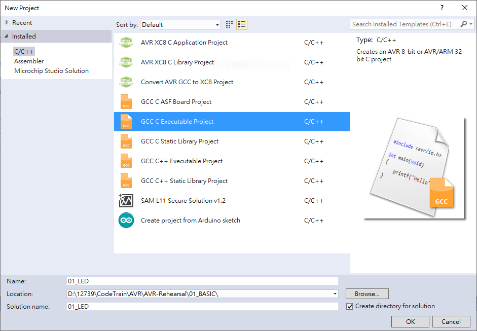
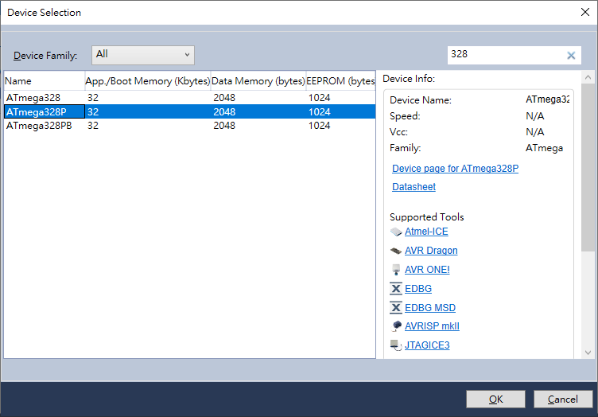

### Overview
This is a simple AVR microcontroller program written in C that controls LEDs using PORTD.  
It demonstrates three key concepts:  
1. PORT I/O - Controlling output pins.
2. DDR (Data Direcion Register) - Setting pins as input or output.
3. XOR Toggle - Flipping LED states.

### Project Setup
1. @ menu bar, choose File > New > Project
2. Name the project name and choose the directory   

3. Define the device your project using (here we using ATmega328P)

### Input the code
You can copy the code or using the file in 01_LED.

### Code Explanation
1. 

### Circuit