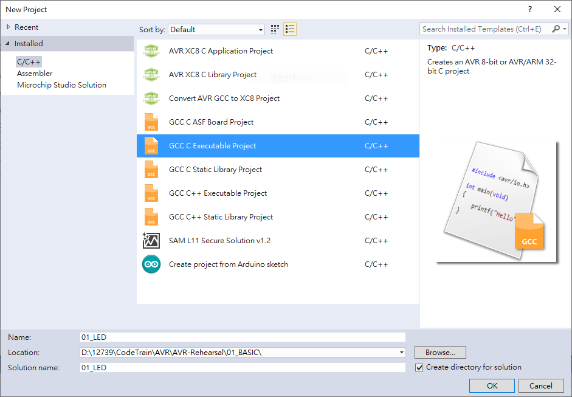
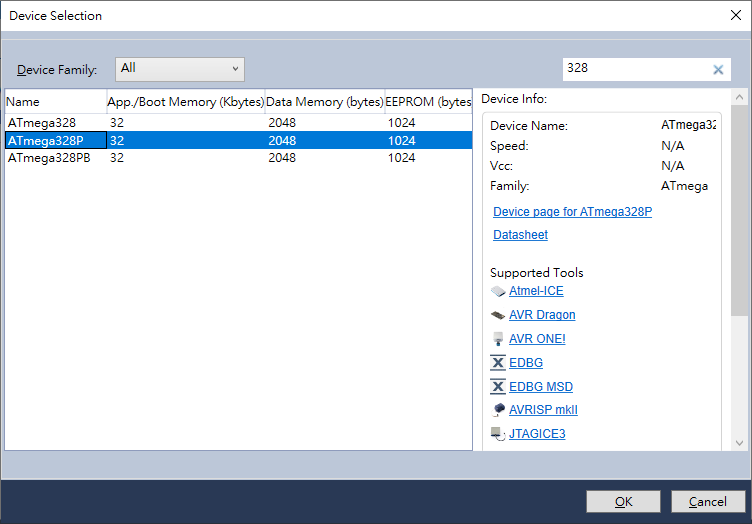

### Overview
AVR C code.
It demonstrates three key concepts:  
1. Timer's prescaler

### NOTE
- You can change the CPU frequency to test out the different.
- You can change the prescaler and observe the LED to find out the differnet.

### Project Setup
1. @ menu bar, choose File > New > Project
2. Name the project name and choose the directory   

3. Define the device your project using (here we using ATmega328P)

### Input the code
You can copy the code or using the file in 02_Timer_Prescaler.

### Code Explanation
0. **Purpose**: Testing Prescaler

---
1.  #define Mhz 1000000UL  
    #define F_CPU 16*Mhz

- Define **CPU Frquency**:  
-- Using for <util/delay.h> & define for CPU running frequency.   
-- It's benefit to arrange the time for any application.

- UL: unsigned long integer
- Need to defiend before including any AVR library headers.

---
2.  #include <avr/io.h>  
    #include <util/delay.h>

- **avr/io.h**:   
-- I/O Port Definitions  
-- Device-Specific Registers (timer, ADC, USART, SPI, etc.)  
-- Bit Manipulateion Macros
-- Device Selection

- **util/delay.h**:  
-- Precise Timing Delays

---

### Circuit